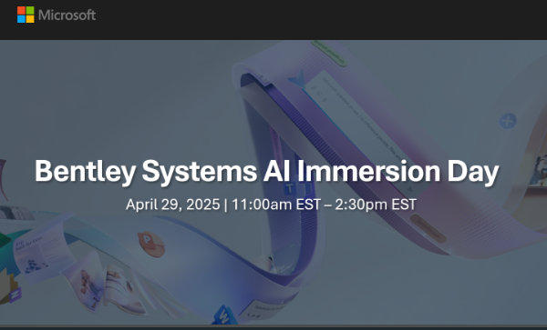
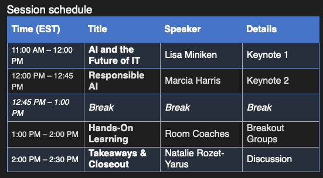

# Bentley Systems - 2025 AI Immersion Day
This repository contains resources and instructions for the Hackathon to implement Microsoft 365 Copilots.

## Agenda

## Scenario
People taking documents and build a simple agent to ask questions. 
At the end of this hackathon, present your learnings, benefits, and applicable use cases in Bentley.

## Reading materials
1. [What is Copilot Studio](https://learn.microsoft.com/en-us/microsoft-copilot-studio/fundamentals-what-is-copilot-studio)
1. [Use SharePoint Content for generative answers](https://learn.microsoft.com/en-us/microsoft-copilot-studio/nlu-generative-answers-sharepoint-onedrive)

## Lab Manual
Please complete each task:

Task 1: Complete the reading list to understand what is is a copilot.

Task 2: Explore using the Microsoft Copilot Chat

Task 3: Navigating Copilot Studio ([answer key](answerkey.md))
- Create a folder in your enterprise OneDrive and upload a few files
   - You can use [the sample files in the /sample folder](documents/) of this repository if you like
- Go to [https://copilotstudio.microsoft.com](https://copilotstudio.microsoft.com) and log in.
- Create an agent that will:
   - Use the above OneDrive folder that you created, and the files in it, as a knowledge source
   - Do NOT use the AI's general knowledge. Make the OneDrive folder the authoritative source for all answers.
   - Test your agent to see if it is working. If you used the files in the sample folder, your agent should be able to answer these questions (but do not restrict your testing to just these questions):
      - "What are the requirements for MicroStation?"
      - "What are the data file variables for MicroStation?"
      - "Give me high level instructions for developing applications using MDL."
      - "What does Bentley Systems do?"
- Note your observations (examples but not limited to the following examples):
   - Does the agent answer questions that are not covered in by the documents in the folder?
   - How did you test/confirm the above?
   - Does it handle translation for you? What langugaes?

Task 4: Edit your Copilot to retrieve the current status of Bentley Cloud Services and recent history of incidents.
- RSS feed for the Bentley Cloud Services is located here: https://status.bentley.com/history.rss
- Expand the capability of your Copilot agent to retrieve the current status of services hosted in the Bentley Cloud Service platform, and a history of recent issues.
- Test your Copilot Agent:
   - Ask about service status
   - Ask details about specific incidents of services that recently had incidents
   

