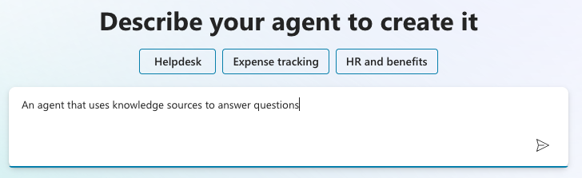
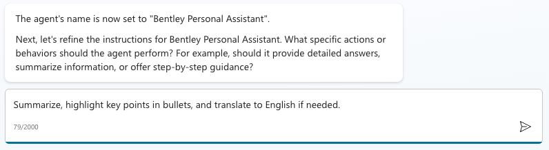
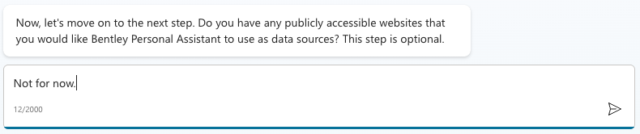
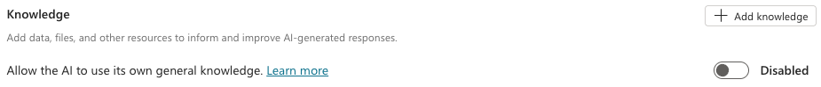

([__Return to lab__](/README.md))
# Answer Key

## Task 3: Creating a copilot agent
Use NLP to kick off the creation of the Agent

Accept the suggested name or pick a different one.

Define/refine the task this agent needs to undertake

Not including public website as sources for now

Click create button (see right margin, towards the top corner)

Test the agent to make sure it is responding. Then edit the agent and select Add Knowldge.

Select ShrePoint.

Paste or type the URL to the folder in your OneDrive (hint: Navigate to that OneDrive folder from your browser and copy the URL)

Give the OneDrive Knowledge Source a name, then click Add.

Disable "Allow the AI to use its own general knowledge". We do this so it will always use the knowledge source(s) and those will be the authoritative source. You will need to confirm this action. Click on the "Learn more" link if you want more information.

