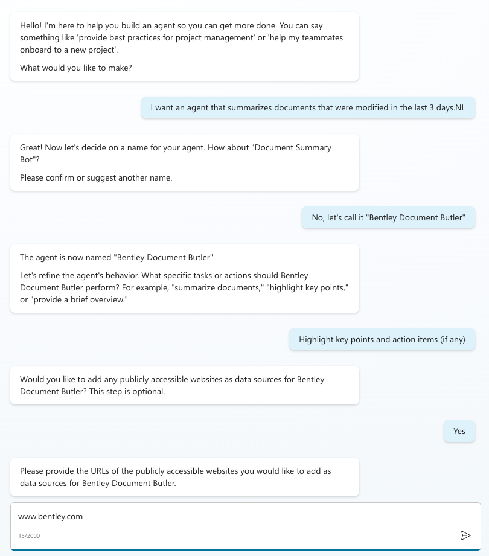

# Answer Key

## Task 3: Creating a copilot agent
Use NLP to kick off the creation of the Agent

Name the Agent

Define/refine the task this agent needs to undertake

Optional - Choose whether to include Web results or not

List URLs to crawl, if you said "Yes" in the above.

